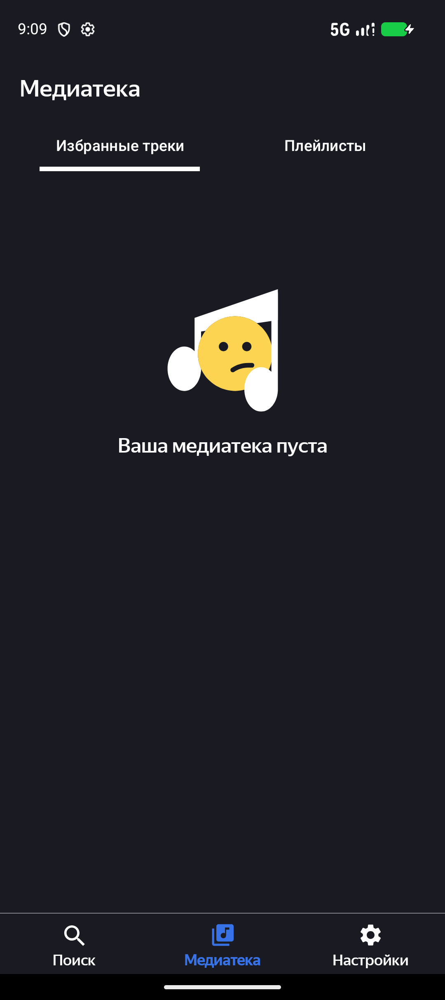

# PlaylistMaker

Учебный проект Яндекс.Практикума по курсу **"Android-разработчик"**.

Приложение для создания плейлистов с использованием [Apple Music API](https://developer.apple.com/documentation/applemusicapi).

---

## 📱 Функциональность

- 🔍 **Поиск музыкальных треков** по названию, исполнителю, альбому
- ▶️ **Прослушивание** бесплатного сэмпла (30 секунд)
- ❤️ **Медиатека** — избранные треки
- 📁 **Плейлисты** — создание и управление плейлистами
- 🌙 **Тёмная тема**

---

## 🛠 Стек технологий

| Категория | Технология |
|-----------|-----------|
| **UI** | XML Layouts, Material Design |
| **Network** | Retrofit, Glide |
| **Database** | Room |
| **Async** | Kotlin Coroutines |
| **DI** | Koin |
| **Architecture** | MVVM |

---

## 📸 Скриншоты

> _Скриншоты будут добавлены позже_

<!--



-->

---

## 🏗 Архитектура

Приложение построено по архитектуре **MVVM**:

```
Presentation (Activity / Fragment)
         │
         ▼
    ViewModel
         │
         ▼
    Repository
         │
    ┌────┴────┐
    ▼         ▼
 Retrofit   Room
 (API)     (Local)
```

---

## 🚀 Установка

```bash
git clone https://github.com/lodrean/PlaylistMaker.git
cd PlaylistMaker
./gradlew assembleDebug
```

---

## 📚 Что изучено

- Работа с внешними API (REST)
- Паттерн Repository
- Хранение данных в локальной БД (Room)
- Асинхронные операции (Coroutines)
- Material Design компоненты
- Jetpack Navigation (частично)

---

## ✅ TODO

- [ ] Миграция на Jetpack Compose
- [ ] Добавить Unit-тесты
- [ ] Добавить скриншоты в README
- [ ] Интеграция с другими музыкальными сервисами

---

## 📄 Лицензия

Учебный проект. Свободное использование с указанием авторства.
